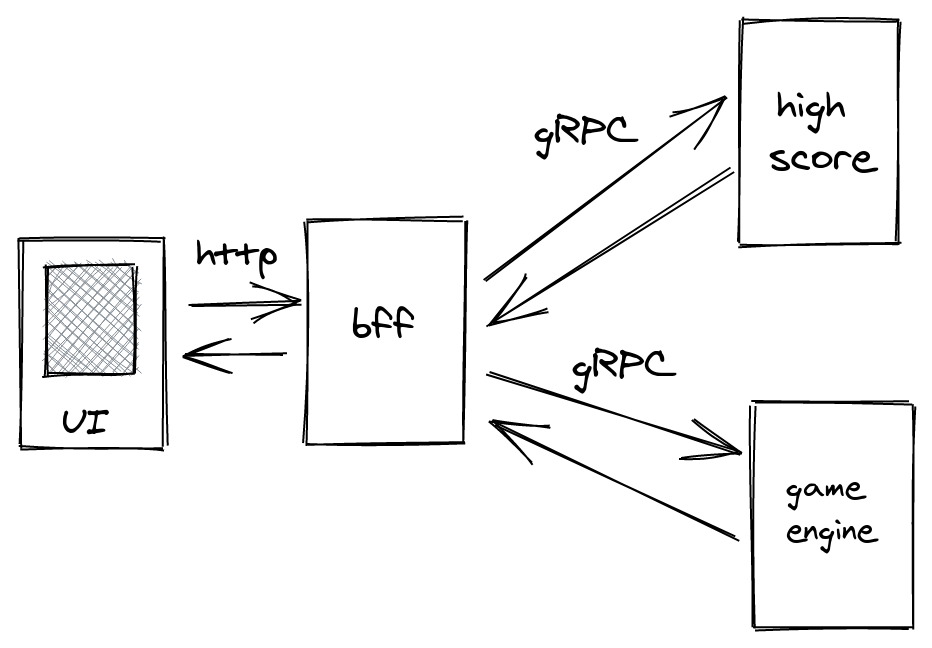

## Motivation
The purpose to make this game is to learn primarily about Microservices architecture, gRPC and Go. In addition to that I also learned about Docker, Kubernetes and Prometheus.

## Introduction
This game will show circle and square of different sizes and user have to click them as soon as possible. If user is clicking quickly (i.e having a good reaction time) then size of the shapes will decrease and vice-versa.

## Architecture
